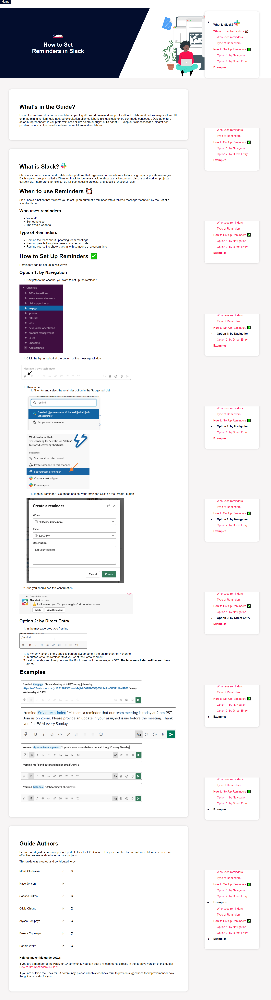

# Hack for LA Website's Guide Pages Prototype

## Project Overview
Guide Pages are "How-To" documentations on various technologies that will help users tackle their tasks used in Development, Design, Project Management, or Professional Development. It is also a section where Hack for LA consistently maintain and post new guides that would be used in the civic tech software community. There are currently [several guide pages](https://www.hackforla.org/toolkit/) available on Hack for LA's live website and Google Docs (view only).

However, there are visual errors on the Guide Pages, and publishing new guides is not user-friendly for maintainers without development background. With the help of Hack for LA's Guides and Website Teams, I took the initiative to redesign and develop the Guide Pages from scratch with Jekyll and JavaScript to make it visually impactful and feasible for maintenance and updates.

## Project Progress
Project Status: Completed. 

[[Visit Live Site]](https://www.hackforla.org/guide-pages/how-to-set-reminders-in-slack.html) 

[[View (Merged) Pull Request]](https://github.com/hackforla/website/pull/3548)

## Previews
[View Prototype](https://alyssabenipayo.github.io/guide-pages/)

[Wireframes via Figma](https://www.figma.com/file/n0YHiNO4MDA9SrMJPPIjoW/Hack-for-LA---Guide-Pages?node-id=118%3A3292)

## Role(s)
Frontend Developer and UI Designer

## Tools
Jekyll (Liquid, HTML), CSS, JavaScript, Google Apps Script, Figma

## Installation
1. Please clone this repository.
`git clone https://github.com/alyssabenipayo/guide-pages.git`

2. Run `jekyll serve` to start "http://127.0.0.1:4000"

## Future Developments and Improvements

### Frontend
- Create mobile version of Guide Pages and ensure responsiveness wish SCSS/Sass.
- Provide users the option to print or share the guide on social media. 
- Show profile picture images of the Guide Authors next to their names.
- Adjust sticky navigation bar to ensure it sticks to the page properly using JavaScript.
- Apply changes to side-nav using Liquid to remove emojis/images next to section/subsection titles.

## Backend
- Develop a Google Apps Script from scratch that will convert all Google Docs into Markdown files efficiently and accurately with special features tailored to the organization's preferences to ease maintenance. 
  - This will reduce manual edits.

## Image

