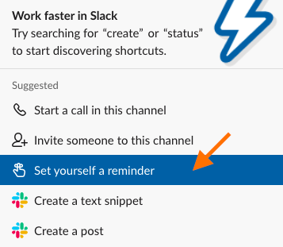

# **What** is Slack?

Slack is a communication and collaboration platform that organizes conversations into topics, groups or private messages. Each topic or group is called a Channel. Hack for LA uses slack to allow teams to connect, discuss and work on projects collectively. There are channels set up for both specific projects, and specific functional roles.

# **When** to use Reminders ⏰

Slack has a function that **allows you to set up an automatic reminder with a tailored message **sent out by the Bot at a specified time.

## Who uses reminders

- Yourself
- Someone else
- The Whole Channel

## Type of Reminders

- Remind the team about upcoming team meetings
- Remind people to update issues by a certain date
- Remind yourself to check back in with someone at a certain time

# **How** to Set Up Reminders ✅

Reminders can be set up in two ways:

## Option 1: by Navigation

1. Navigate to the channel you want to set up the reminder \

2. Click the lightning bolt at the bottom of the message window
   

3. Then either
   1. filter for and select the reminder option in the Suggested list \

\

    2. Type in “reminder” \

Go ahead and set your reminder. Click on the “create” button

4. and you should see this confirmation.

## Option 2: by Direct Entry

1. In the message box, type /remind
   

2. To Whom? @ or # \
   If to a specific person: @someone \
   If the entire channel: #channel
3. In quotes write the reminder text you want the Bot to send out.
4. Last, input day and time you want the Bot to send out the message. **NOTE: the time zone listed will be your time zone.**

# **Examples**

<!-- # **Guide Authors**

Peer-created guides are an important part of Hack for LA’s Culture. They are created by our Volunteer Members based on effective processes developed on our projects.

This guide was created and contributed to by: Maria Studnicka, Katie Jensen, Saasha Gilkes, Oliva Chiong, Alyssa Benipayo, Bukola Ogunleye and Bonnie Wolfe

If you would like to contribute, please see the contribution methods available:

If you are a member of the Hack for LA community you can post any comments directly in the iterative version of this guide: [How to Set Reminders in Slack](https://www.google.com/).

If you are outside the Hack for LA community, please use this [feedback form](https://www.google.com/) to provide suggestions for improvement or how the guide is useful for you. -->
